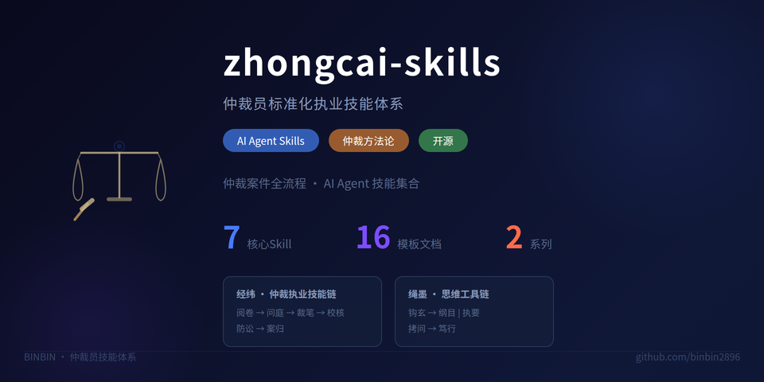

<p align="center">
  
</p>

## 在确定性与不确定性之间，寻找可复用的结构。
**I build tools that turn fuzzy problems into clear decisions.**

---

### ⛓️ [经纬](https://github.com/binbin2896/zhongcai-skills) — 仲裁执业技能链

从收案到归档的全流程标准化工作流。每起案件按此链执行，确保庭前准备充分、庭审提问精准、裁决书结构严谨、司法审查无虞、经验沉淀入库。

```
经纬（入口编排）
├─ 阅卷 → 庭前阅卷 · 三层五要素法
├─ 问庭 → 庭审问题清单 · 80+/60+ 题库
├─ 裁笔 → 裁决书草拟 · 九段式结构 + 案例引用
├─ 校核 → 三十项风险校核 · 程序合规性检查
├─ 防讼 → 司法审查风险预演 · 撤裁事由排查
└─ 案归 → 案件复盘 · 经验提炼 · 知识库入库
```

| 原则 | 说明 |
|------|------|
| **标准化** | 每起案件按同一流程执行，保证质量基线 |
| **可复用** | 模板、清单、案例库持续积累，越用越强 |
| **可校验** | 每个步骤有明确的输出物和质检标准 |
| **可迭代** | 每案复盘反哺模板和知识库，形成飞轮 |

#### 适用场景

- 收到新案卷 → 走**阅卷**做三层五要素梳理
- 庭前准备 → 走**问庭**生成针对性问题清单
- 裁决书草拟 → 走**裁笔**按九段式搭结构
- 裁决书质检 → 走**校核** + **防讼**双重把关
- 结案归档 → 走**案归**提炼经验、反哺知识库

---

### 🧠 [绳墨](https://github.com/binbin2896/sheng-mo) — 思维工具链

从信息提炼到执行落地，一条完整的思考方法论。

> 典出《孟子·离娄上》：绳墨者，规矩方圆之至也。木工取直用绳墨，明辨事理出规矩。

```
绳墨（编排入口）
├─ 钩玄 → 信息提炼 · 从万字信息中捞出核心
├─ 纲目 → 方向判断 · 一个判断 + 三个行动 + 排除项
├─ 执要 → 优先级排序 · 紧急 × 重要四象限
├─ 拷问 → 压力测试 · 八维度方案/内容质检
└─ 笃行 → 执行落地 · 可执行清单 + 风险预案
```

- [钩玄](https://github.com/binbin2896/sheng-mo/tree/main/gou-xuan) — 信息提炼：从万字信息中捞出三句话核心
- [纲目](https://github.com/binbin2896/sheng-mo/tree/main/gang-mu) — 方向判断：一个核心判断，三个关键行动，一组排除项
- [执要](https://github.com/binbin2896/sheng-mo/tree/main/zhi-yao) — 优先级排序：把"都要做"变成"只做三件最重要的"
- [拷问](https://github.com/binbin2896/sheng-mo/tree/main/kao-wen) — 压力测试：方案与内容系统性质检框架
- [笃行](https://github.com/binbin2896/sheng-mo/tree/main/du-xing) — 执行落地：把结论翻译成可执行清单

#### 适用场景

- 信息太多、问题模糊 → 走完整链：钩玄 → 纲目 → 拷问 → 笃行
- 方案已定需质检 → 直接调**拷问**
- 结论已定需执行清单 → 直接调**笃行**
- 选项太多需排序 → 直接调**执要**

---

### 知其白，守其黑，为天下式。

---

## 📋 模板与案例

路径 `docs/` 下包含：

### 写作模板（8份）

| # | 模板 | 说明 |
|---|------|------|
| 01 | 阅卷笔录模板 | 三层五要素 + 建工版/房地产版增补 |
| 02 | 庭审问题清单模板 | 建设工程80问 + 商品房60问 |
| 03 | 裁决书标准结构模板 | 简式/普通/复杂/调解四版 |
| 04 | 裁决书三十项风险校核清单 | 六类30项 🔴🟡🟢 标记 |
| 05 | 程序合规性自查清单 | 27项自查 + 10类高频违规防范 |
| 06 | 司法审查应对手册 | 5大撤裁事由 + 12种违规情形分析 |
| 07 | 仲裁员能力自评矩阵 | 9维度 + 背景预判 + 学习路径 |
| 08 | 技能复盘与持续优化机制 | 每案/月/季三级复盘 + 版本管理 |

### 精析案例（8个）

涵盖：仲裁条款瑕疵、主体不适格、审理范围、盖章行为效力、合同性质认定、释明义务、先票后款前提、背靠背条款等建设工程及房地产仲裁高频争议。

---

## 🚀 快速开始

### 前提

本 Skill 集合设计为与 [Hermes Agent](https://hermes-agent.nousresearch.com) 或任何支持 SKILL.md 标准的 AI Agent 运行时兼容。

### 安装

```bash
# 克隆仓库
git clone https://github.com/binbin2896/zhongcai-skills.git

# 将 skills 目录链接到 Agent 的 skills 路径
# Hermes Agent:
ln -s $(pwd)/skills/* ~/.hermes/skills/legal/

# 或直接复制
cp -r skills/* ~/.hermes/skills/legal/
```

### 使用示例

```
用户：帮我处理这个仲裁案件——收到仲裁申请书和证据材料
→ 经纬自动判断为庭前阶段 → 推荐加载阅卷

用户：走一遍仲裁流程
→ 经纬按阅卷→问庭→裁笔→校核→防讼→案归顺序执行全流程
```

---

## 🧩 作为独立 Skill 使用

每个子目录都是一个独立完备的 SKILL.md，可单独加载使用：

```bash
# 只加载阅卷 skill
hermes skill load arbitration-reading
# 或
cp arbitration-reading/SKILL.md ~/.hermes/skills/
```

---

## 📖 命名与典籍

| Skill | 典籍出处 | 含义 |
|-------|---------|------|
| 经纬 | 《左传》"经纬天地曰文" | 案件经纬万端，持经纬以度之 |
| 阅卷 | 行业通用语 | 三层五要素阅卷 |
| 问庭 | "问"=提问，"庭"=仲裁庭 | 以问题为刀，剖开真相 |
| 裁笔 | "裁"=裁断，"笔"=书写 | 九段为骨，案例为鉴 |
| 校核 | "校"=校勘，"核"=核实 | 最后一道防线 |
| 防讼 | 《论语》"必也使无讼乎" | 最好的应诉是不必应诉 |
| 案归 | "案"=案件，"归"=归档 | 每个案件留下一点东西 |
| 绳墨 | 《孟子》"规矩方圆之至也" | 从混沌信息到清晰行动 |
| 钩玄 | 韩愈《进学解》"记事者必提其要" | 提玄钩要 |
| 纲目 | 朱熹《通鉴纲目》 | 一纲三目 |
| 执要 | 韩非《扬权》"事在四方，要在中央" | 抓主要矛盾 |
| 拷问 | 语义直用 | 压力测试 |
| 笃行 | 《中庸》"笃行之" | 知行合一 |

---

## 🤝 贡献

欢迎提交 Issue 和 PR。

### 开发指南

1. Fork 本仓库
2. 创建特性分支：`git checkout -b feat/my-feature`
3. 提交改动：`git commit -m 'feat: add something'`
4. 推送到分支：`git push origin feat/my-feature`
5. 创建 Pull Request

---

## 📄 License

MIT © BINBIN

---

<p align="center">
  <sub>Train your skills like you train your models.</sub>
</p>
